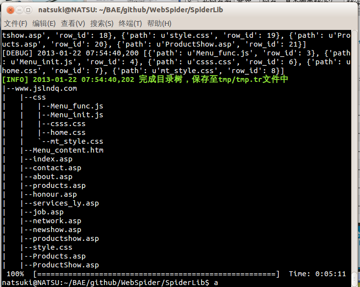

WebSpider
=========
##开发环境
python2.7

##概述
爬虫工具对指定站点，深度，关键字的页面信息进行指定线程数的抓取，并将数据保存到sqlite数据库中，同时分等级的保存工作时的信息到日志中，亦可按需求将页面转换为本地文件进行浏览。关键字格式参考google hacking格式，可进行特色个性化的抓取，工作时可按需求将数据信息保存，便于今后的分析和再次利用。

##设计思路
利用python的客户端库模拟浏览器访问url，并分析url的域名，深度等信息；正则表达式模块分析页面信息；多线程模块提高抓取效率；数据库操作模块保存页面数据；日志模块分等级保存和显示日志信息；本地文件操作模块保存页面数据。

##模块设计

##功能设计
###交互与控制
用户与程序的交互：生成命令行帮助，从命令行获取用户参数指令。
程序流程的调用与控制的功能，将用户的指令参数通过一些必要的处理交给程序相应的函数执行。
<pre><code>import argparse,textwrap
class SpiderOpt(object):
    '''命令行参数处理模块
    usage: %prog [option] args\n%prog -u url -d deep -f logfile -l loglevel(1-5)  --testself -thread number --dbfile  filepath  --key=”HTML5”
    '''
    def add_args(self):
        ……
    def check(self):
        '''检查选项值格式'''
        ……</code></pre>
        
###爬虫功能
页面处理：获取分析下载页面信息，以宽度优先遍历获取url，对于返回的http状态码，进行相应的处理；
<pre><code>def get_page(self, *args, **kwargs):
    	'''下载页面'''
		now_url = self.pop_url()
		try:
			req = urllib2.urlopen(now_url)
			content = req.read()
			……
			#将页面的内容存入本地数据库
			#mimetype = req.info().getheaders('Content-Type')[0].split(';')[0]
			self.save_url(content, now_url)
			……
				self.save_page(**tmp_data)

	def after_status(self, **obj):
		'''根据状态码，调用不同的处理方式'''
		statusFunc={
				202:self.wait_page(),#阻塞等待
				300:None,#丢弃
				301:self.redL_page(),#永久重定向
				302:self.redS_page(),#临时重定向
		……

	def find_key(self, content):
		print '''分析页面关键字'''</code></pre>

url处理：url符合需求的存入url队列，从url队列中取出url访问进行页面分析。
<pre><code>def check_url(self, now_url, url):
    	'''检查url格式
		去除路径中多余的/;
'''
		try:
			if not re.match(r'https?://\w+(?:\.\w+)+', url):
				#判断字符串格式
				url = urljoin(now_url, url)
			url_pack = self.get_scheme_netloc_path_(url)
			path = re.compile(r'/+').sub('/', url_pack.path)
			……
			url = urlunparse(ParseResult(scheme=url_pack.scheme, netloc=url_pack.netloc, path=path, params=url_pack.params, query=url_pack.query, fragment=url_pack.fragment))
			……
	def check_site(self,url):
		'''检查url是否同一站点，是则返回True'''
		……</code></pre>
        
        
线程分配：指定的线程数生成相应大小的线程池，放入线程池队列中；根据实时获取的url队列大小，将上述任务分配给多线程去执行。
        
        <pre><code>
        def myJob(self,th_q):
    	'''一个工作线程'''
		……
	def myWork(self):
		while True:
			……
			th_q = int(math.ceil(qsize / float(thread_size)))	#一个线程分配多少个url
			for t in range(thread_size):	#线程分发
				tp.add_job(self.myJob(th_q))
				th_q = int(math.ceil(self.urlq.qsize() / float(thread_size)))	#一个线程分配多少个url
			tp.wait_for_complete()
			print '线程池回收'
			#判断url队列的大小是否为0，等待30秒
			time.sleep(3)
		self.end_work()
        </code></pre>
        
###工作队列
URL队列：创建队列，存取url，通过hash查询维护队列中url，防止存入已被访问的url。

<pre><code>class UrlQ(object):
	def __init__(self):
		self.urlQ = Queue.Queue(0)
		self.visit = list()
	def del_re(self, data):
		'''检查重复的url'''
		return comm.get_hash(data) in self.visit</code></pre>
		
线程池队列：创建工作队列，结果队列，产生相应的数量线程，将工作存入队列，等待线程完成。
<pre><code>
class ThreadPool(object):
	def __init__(self, num_of_threads=3):
		……
		self.__createThreadPool(num_of_threads)
	def __createThreadPool(self, num_of_threads):
		for i in range(num_of_threads):
			thread = MyThread(self.workeQueue, self.resultQueue)
			self.threads.append(thread)
	def wait_for_complete(self):
		#等待所有线程完成
		while len(self.threads):
			thread = self.threads.pop()
			#等待线程结束
			if thread.isAlive():
				#判断线程存活 是否调用join
				thread.join()
	def add_job(self, callable, *args, **kwargs):
		self.workeQueue.put((callable, args, kwargs))
</code></pre>

多线程处理：创建初始化线程，从工作队列中取出任务，将任务的结果放入结果队列，判断工作队列是否为空结束线程。
<pre><code>
import threading
class MyThread(threading.Thread):
	def __init__(self, workQueue, resultQueue,timeout=3, **kwargs):
		……
		self.start()
	def run(self):
		while True:
			try:
				#从工作队列中获取一个任务
				callable, args, kwargs = self.workQueue.get(timeout=self.timeout)
				#我们要执行的任务
				try:
					res = callable(args, kwargs)
					if res:
						#把任务返回的结果放在结果队列中
						self.resultQueue.put(res+" | "+self.getName())   
				except:
					pass
			except Queue.Empty: #任务队列空的时候结束此线程
				break
</code></pre>

##程序界面

